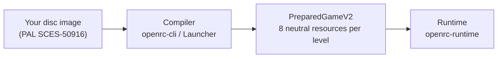

# OpenRC

[](LICENSE)


**OpenRC** is a native PC reimplementation of **Ratchet & Clank** (PlayStation 2,
2002) that runs without a PS2 emulator. Like [OpenGOAL](https://opengoal.dev/)
did for Jak and Daxter, the goal is to keep the original gameplay faithful while
adding modern platform features.

> [!IMPORTANT]
> OpenRC does not contain game code, game assets, disc images, Sony SDK files,
> or leaked material. You must provide your own legally obtained PlayStation 2
> disc image. Local game data is excluded from version control.

> [!NOTE]
> OpenRC is in early development and **is not playable from start to finish
> yet**. The current milestone is the original new-game flow into Veldin.

## Contents

- [Status](#status)
- [Getting started](#getting-started)
- [Controls](#controls)
- [Building for development](#building-for-development)
- [How it works](#how-it-works)
- [Documentation](#documentation)
- [Related projects](#related-projects)
- [License](#license)

## Status

**Current milestone: [First Playable](docs/FIRST_PLAYABLE.md).** The goal is the
original startup, intro, menu and New Game, then introductory Veldin from start
to finish into Novalis.

| Area | State | Notes |
| --- | :---: | --- |
| Disc reading and asset formats | ✅ | ISO, hidden TOC, WAD/LZ, textures, models, collision, audio banks and text decoded on all 19 levels |
| Native game packages | ✅ | all 19 levels compiled once into a verified [`PreparedGameV2`](docs/PREPARED_GAME_V2.md) installation |
| Startup, menu and New Game | 🟡 | original intro, menu, movies and loading cards reach a controllable Veldin; the original level entry is not qualified yet |
| Ratchet movement | 🟡 | original pad response and ground pace recovered; airborne movement and full state transitions in progress |
| Camera | 🟡 | original camera [documented](docs/RAC_GAMEPLAY_CAMERA_V1.md); the game still uses a developer camera |
| Rendering | 🟡 | terrain (partial), static objects, TIE and a skinned Ratchet; shrubs and most animated objects pending |
| Animation | 🟡 | Ratchet idle, walk and run; Veldin actors; airborne and wrench animation pending |
| Enemies, HUD, in-level cutscenes, level audio | ❌ | not integrated yet |

✅ done · 🟡 in progress · ❌ not started. Everything implemented so far is listed
in detail in [Components](docs/COMPONENTS.md), and the step-by-step plan is in
the [Roadmap](docs/ROADMAP.md).

## Getting started

### Requirements

- Windows 10 or 11, x64.
- Your own disc image of the **PAL release, `SCES-50916` v2.00**. This is the
  supported [reference build](docs/REFERENCE_BUILD.md). The NTSC-U release
  (`SCUS-97199`) is recognized but not supported yet.

### Build and run

The pinned toolchain (LLVM-MinGW and CMake) is downloaded once into the ignored
`local/tools` folder. Details are in [Build environment](docs/BUILD_ENVIRONMENT.md).

```powershell
powershell -NoProfile -ExecutionPolicy Bypass -File scripts\bootstrap-toolchain.ps1
.\scripts\build-portable.ps1
.\build-portable\openrc-launcher.exe
```

In the Launcher:

1. Select your disc image.
2. Click **Prepare native game**. OpenRC verifies the disc and compiles all 19
   levels once into `%LOCALAPPDATA%\PlunkDev\OpenRC\prepared-v2`.
3. Click **Play**. The game runs from the prepared installation alone. The disc
   image is not opened again.

Settings live in `%APPDATA%\PlunkDev\OpenRC`, and cache, logs and prepared data
in `%LOCALAPPDATA%\PlunkDev\OpenRC`.

## Controls

| Action | Keyboard and mouse | Controller (XInput) |
| --- | --- | --- |
| Move (relative to the camera) | `W` `A` `S` `D` | Left stick (a light tilt walks) |
| Camera | Arrow keys | Right stick |
| Jump | `Space` | `A` / Cross |
| Wrench attack | `F` or left mouse button | `X` / Square |
| Reset to checkpoint | `R` | — |

## Building for development

Open a **Visual Studio Developer PowerShell** in the repository folder:

```powershell
cmake -S . -B build -A x64
cmake --build build --config Debug
ctest --test-dir build -C Debug --output-on-failure
```

This produces `openrc-cli.exe`, `openrc-launcher.exe` and `openrc-runtime.exe`
in `build/Debug`. Development build folders such as `build`, `build-werror` and
others are workspaces only. Always run the player-facing build from
`build-portable`, which [`scripts/build-portable.ps1`](scripts/build-portable.ps1)
rebuilds and verifies (AMD64, matching hashes, no dynamic compiler-runtime DLLs).

`openrc-cli` contains the compiler and diagnostic tools: disc inspection, format
dumps, texture and audio export, package preparation and smoke tests. See the
[command-line reference](docs/CLI.md). Workspace rules for contributors and
agents are in [AGENTS.md](AGENTS.md).

## How it works



- **The compiler** is the only part that reads the disc and boot ELF. It decodes
  the original formats and converts each level into eight neutral resources:
  collision, bootstrap, render scene, actor library, actor animations,
  entities, gameplay and destructibles.
- **The runtime** loads only those packages. It never sees disc offsets, class
  IDs or PS2 formats, which keeps it portable and ready for mods.
- **Fidelity is proven, not assumed.** Behavior is recovered from the original
  executable and checked against reference captures. OpenRC's own policies are
  labelled as such.

More in [Architecture](docs/ARCHITECTURE.md) and
[PreparedGameV2 and LevelPackageV1](docs/PREPARED_GAME_V2.md).

## Documentation

**Project**

- [Architecture](docs/ARCHITECTURE.md) · [Roadmap](docs/ROADMAP.md) ·
  [First Playable milestone](docs/FIRST_PLAYABLE.md)
- [Components](docs/COMPONENTS.md) · [Command-line reference](docs/CLI.md)
- [Reference build](docs/REFERENCE_BUILD.md) ·
  [Build environment](docs/BUILD_ENVIRONMENT.md) ·
  [Legal and project boundaries](docs/LEGAL.md)

<details>
<summary><b>Neutral runtime resources</b> (formats the runtime loads)</summary>

- Packages: [PreparedGameV2](docs/PREPARED_GAME_V2.md) ·
  [publishing](docs/PREPARED_GAME_V2_PUBLISH_V1.md) ·
  [level foundation package](docs/LEVEL_FOUNDATION_PACKAGE_V1.md) ·
  [runtime level foundation](docs/RUNTIME_LEVEL_FOUNDATION_V1.md)
- World: [collision](docs/COLLISION_WORLD_V1.md) ·
  [level bootstrap](docs/LEVEL_BOOTSTRAP_V1.md) ·
  [render scene](docs/RENDER_SCENE_V1.md) ·
  [ordered spatial index](docs/ORDERED_SPATIAL_INDEX_V1.md) ·
  [placement admission](docs/PLACEMENT_ADMISSION_V1.md)
- Actors and gameplay: [actor library](docs/ACTOR_LIBRARY_V1.md) ·
  [entity scene](docs/ENTITY_SCENE_V1.md) ·
  [gameplay scene](docs/GAMEPLAY_SCENE_V1.md) ·
  [destructible scene](docs/DESTRUCTIBLE_SCENE_V1.md) ·
  [actor behavior scene](docs/ACTOR_BEHAVIOR_SCENE_V1.md)
- Session and presentation: [session state](docs/SESSION_STATE_V1.md) ·
  [state installation](docs/STATE_INSTALLATION_V1.md) ·
  [frontend sequence](docs/FRONTEND_SEQUENCE_V1.md) ·
  [scene timeline](docs/SCENE_TIMELINE_V1.md) ·
  [screen overlay](docs/SCREEN_OVERLAY_V1.md) ·
  [image presentation](docs/IMAGE_PRESENTATION_V1.md) ·
  [loading presentation](docs/LOADING_PRESENTATION_V1.md) ·
  [media clip](docs/MEDIA_CLIP_V1.md)
- Audio: [program](docs/AUDIO_PROGRAM_V1.md) ·
  [stream](docs/AUDIO_STREAM_V1.md) · [voice](docs/AUDIO_VOICE_V1.md) ·
  [voice bank](docs/AUDIO_VOICE_BANK_V1.md) ·
  [gain table](docs/AUDIO_GAIN_TABLE_V1.md) ·
  [Windows program bank](docs/WINDOWS_AUDIO_PROGRAM_BANK_V1.md)

</details>

<details>
<summary><b>Source recovery</b> (how the original game behaves)</summary>

- Frontend and menu: [title](docs/RAC_FRONTEND_TITLE_V1.md) ·
  [main compile](docs/RAC_FRONTEND_MAIN_COMPILE_V1.md) ·
  [scene compile](docs/RAC_FRONTEND_SCENE_COMPILE_V1.md) ·
  [environment compile](docs/RAC_FRONTEND_ENVIRONMENT_COMPILE_V1.md) ·
  [draw](docs/RAC_FRONTEND_DRAW_V1.md) ·
  [textures](docs/RAC_FRONTEND_TEXTURE_V1.md) ·
  [objects](docs/RAC_FRONTEND_OBJECT_V1.md) ·
  [lists](docs/RAC_FRONTEND_LIST_V1.md) ·
  [text nodes](docs/RAC_FRONTEND_TEXT_NODE_V1.md) ·
  [decoration](docs/RAC_FRONTEND_DECORATION_V1.md) ·
  [loading](docs/RAC_FRONTEND_LOADING_V1.md)
- Text: [text bank](docs/RAC_TEXT_BANK_V1.md) ·
  [text layout](docs/RAC_TEXT_LAYOUT_V1.md)
- Ratchet: [locomotion](docs/RAC_PLAYER_LOCOMOTION_V1.md) ·
  [airborne](docs/RAC_PLAYER_AIRBORNE_V1.md) ·
  [sequences and poses](docs/RAC_RATCHET_POSE_V1.md) ·
  [gameplay camera](docs/RAC_GAMEPLAY_CAMERA_V1.md)
- Mobys (game objects): [admission](docs/RAC_MOBY_ADMISSION_V1.md) ·
  [allocation](docs/RAC_MOBY_ALLOCATE_V1.md) ·
  [fresh constructor](docs/RAC_MOBY_FRESH_CONSTRUCTOR_V1.md) ·
  [authored tail](docs/RAC_MOBY_AUTHORED_TAIL_V1.md) ·
  [references](docs/RAC_MOBY_REFERENCE_V1.md) ·
  [post step](docs/RAC_MOBY_POST_V1.md) ·
  [sequence sets](docs/RAC_MOBY_SEQUENCE_SET_V1.md)
- Levels and Veldin: [level entry](docs/LEVEL_ENTER_SOURCE_V1.md) ·
  [frame schedule](docs/RAC_LEVEL_FRAME_SCHEDULE_V1.md) ·
  [Veldin start triggers](docs/RAC_VELDIN_START_TRIGGERS_V1.md) ·
  [Veldin scene 4](docs/RAC_VELDIN_SCENE4_EXECUTION_V1.md) ·
  [Veldin world coverage](docs/VELDIN_WORLD_COVERAGE_V1.md)
- Scenes and rendering: [scene animation](docs/RAC_SCENE_ANIMATION_COMPILE_V1.md) ·
  [movie lifetime](docs/RAC_MOVIE_LIFETIME_V1.md) ·
  [instance lighting](docs/RAC_INSTANCE_LIGHTING_V1.md)
- Numeric fidelity: [numeric recovery](docs/SOURCE_NUMERIC_RECOVERY_V1.md) ·
  [multiplier reference](docs/SOURCE_MULTIPLIER_REFERENCE_V1.md) ·
  [DIV/ACC reference](docs/SOURCE_DIV_ACC_REFERENCE_V1.md)
- Baselines: [runtime smoke](docs/RUNTIME_SMOKE_BASELINE.md) ·
  [portable main](docs/RUNTIME_PORTABLE_MAIN_BASELINE.md)

</details>

## Related projects

Other community work on the PS2 Ratchet & Clank games:

- [ReRAC](https://github.com/re-rac/rerac): a native rewrite of Ratchet & Clank
  in Rust on Bevy (NTSC-U).
- [Lombyte](https://github.com/lombyte-project/Lombyte) and
  [OpenRAC](https://github.com/OpenRAC/OpenRAC): matching decompilations.
- [Wrench](https://github.com/chaoticgd/wrench): modding tools and a level
  editor for the whole PS2 series.
- [OpenGOAL](https://opengoal.dev/): the Jak and Daxter port that inspired the
  usability goals in the [Roadmap](docs/ROADMAP.md#opengoal-like-usability-contract).

## License

OpenRC's source code is released under the [ISC License](LICENSE). The license
covers only this repository's code and documentation. It grants no rights to
Ratchet & Clank, its code or its assets, which remain the property of their
owners. GPL-licensed code such as Wrench must not be copied into OpenRC; see
[Legal and project boundaries](docs/LEGAL.md).

Ratchet & Clank is a trademark of Sony Interactive Entertainment. OpenRC is an
unofficial fan project and is not affiliated with or endorsed by Sony
Interactive Entertainment or Insomniac Games.
